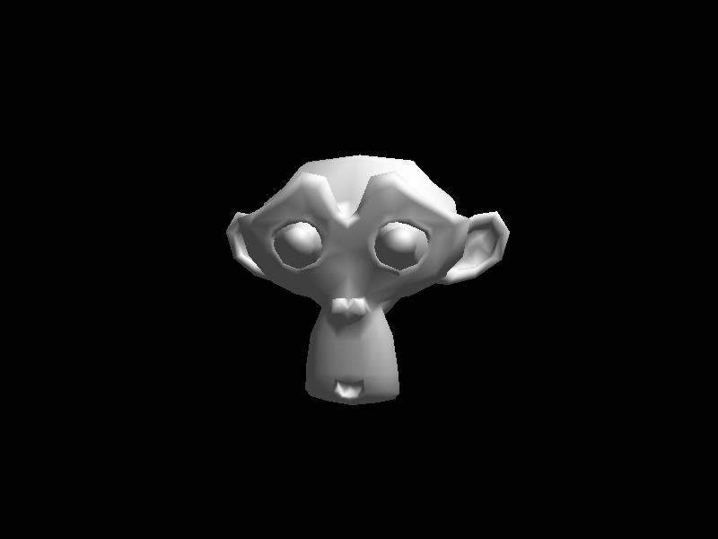
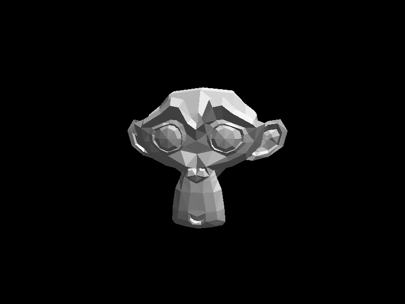

# simple-sw-rasterizer

A simple rasterizer implemented for learning

## Notes

- All angles are in radians unless specified
	- Use `_deg` literal to convert values
- Include `ssr/math.hpp` instead of `linalg.h` (it puts everything in our `ssr` namespace)

## References

- https://www.scratchapixel.com/lessons/3d-basic-rendering/rasterization-practical-implementation/overview-rasterization-algorithm
- https://google.github.io/filament/Filament.html

## Gallery

### Sept 26, 2021

Smooth shading.

### Sept 3, 2021

Everything so far: basic shading (hardcoded "half lambert" shader for now), OBJ loading, camera positioning, etc.

